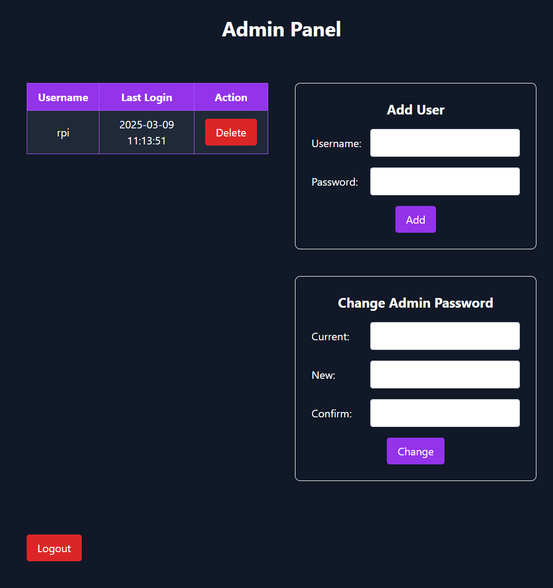

# Private File Server Powered by Directory Lister

This is a private file server built using [Directory Lister](https://www.directorylister.com/), enhanced with a fun and custom secure login system and a functional admin panel for user management.

## Features

* **Secure Login:** A custom login system to protect your files from unauthorized access.
* **User Management:** An admin panel to easily add, edit, and delete users.
* **Directory Lister Core:** Leverages the simplicity and efficiency of Directory Lister for file browsing.
* **Private Access:** Only authorized users can access the file server.
* **Fun Login Experience:** The Viral Panda covering it's eyes while you type your password is implemented for a fun experience when you log in.
* **User Management:** A functional Admin panel is built-in to easily create,delete users.

## Installation
1.  **Install Directory Lister:**
    * Download the latest version of Directory Lister from [directorylister.com](https://www.directorylister.com/).
    * Extract the files to the "/files" directory.
2.  **Setting Up**
    * Update `/index.php` and `/admin_login/index.php` Session Validation section.
    * Copy the contents of nginx.conf file and put in your nginx installation directory. Change domain, and php-fpm version according to your needs.
3.  **Configure Directory Lister:**
    * Customize the `config.php` file to suit your needs.
    * Ensure that the login system and admin panel integrate correctly with Directory Lister's file browsing functionality.
4.  **Secure Your Installation:**
    * Change the default admin password from the admin panel and use HTTPS if you intend to use it outside your local network.

## Usage

1.  **Access the Login Page:** Navigate to the server's URL in your web browser.
2.  **Log In:** Enter your username and password.
3.  **Browse Files:** Once logged in, you can browse and download files using Directory Lister's interface.
4.  **Calculate Hash:** If you want to calculate the hash of a file, you can do so by clicking the (i) button
5.  **Admin Panel:** Access the admin panel through a designated URL (`/admin`) The default username and password are set to *admin* , *admin*.
6.  **User Management:** Use the admin panel to add or delete users, changing administrator's password.

## Screenshots

## Security
Regularly update Directory Lister and your custom code to ensure the latest security patches

## License
This Project is Under MIT Lisence. You can use it for free, but you must give credit to the original author.
